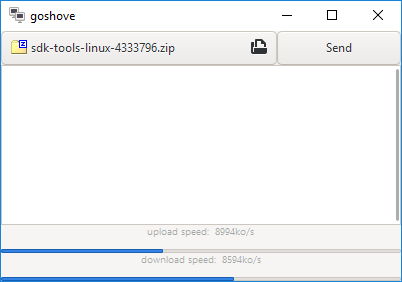

# goshove 

Send files easily and fast by peer-to-peer.

Uses **very aggressive** custom UDP congestion control (and hole punching for peer-to-peer connectivity establishment).

This project has three parts:
- a Go library for file sharing, `libgoshove`, in `/`
- a CLI frontend, `goshove`, in `/cmd/goshove/`
- a GTK3 frontend, `goshove-gtk`, in `/cmd/goshove-gtk/`

Building notes:
- `go get github.com/delthas/picopacker`
- make sure to `go generate` after editing any Glade files

| OS | goshove | goshove-gtk |
|---|---|---|
| Linux x64 | [link](https://delthas.fr/goshove/linux/goshove) | [link](https://delthas.fr/goshove/linux/goshove-gtk) |
| Mac OS X x64 | [link](https://delthas.fr/goshove/mac/goshove) | follow build instructions |
| Windows x64 | [link](https://delthas.fr/goshove/windows/goshove.exe) | [link](https://delthas.fr/goshove/windows/goshove-gtk.zip) (use `goshove-gtk.bat`) |

